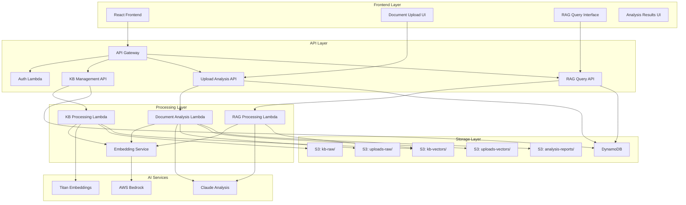
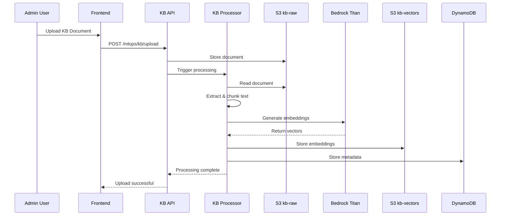
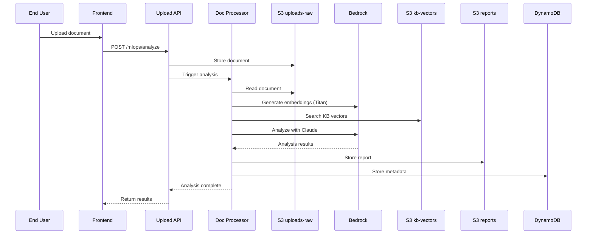
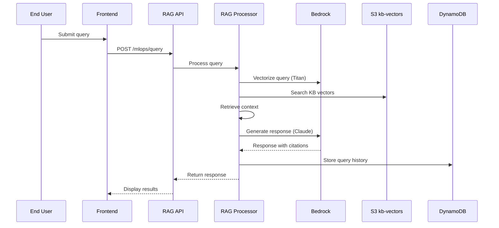

# Design Document

## Overview

The MLOps Finance pipeline extends the existing SaaS template with AI-powered document analysis capabilities for financial compliance and regulatory verification. The system maintains strict data separation between a Company Knowledge Base (KB) of regulatory documents and user-uploaded documents, providing automated compliance analysis through AWS Bedrock, LangChain orchestration, and vector-based semantic search.

## Architecture

### High-Level Architecture



### Data Flow Architecture

#### 1. Knowledge Base Ingestion Flow


#### 2. Document Analysis Flow


#### 3. RAG Query Flow


## Components and Interfaces

### 1. S3 Storage Components

#### Knowledge Base Storage
```python
# S3 Bucket Structure
kb_raw_bucket = f"{project_name}-{stage}-kb-raw"
kb_vectors_bucket = f"{project_name}-{stage}-kb-vectors"

# Directory Structure
# kb-raw/
#   ├── policies/
#   │   ├── document1.pdf
#   │   └── document2.docx
#   ├── regulations/
#   │   └── regulation1.pdf
#   └── metadata/
#       └── index.json

# kb-vectors/
#   ├── embeddings/
#   │   ├── doc1_chunks.json
#   │   └── doc2_chunks.json
#   └── index/
#       └── vector_index.json
```

#### User Upload Storage
```python
# Upload bucket structure with tenant isolation
uploads_raw_bucket = f"{project_name}-{stage}-uploads-raw"
uploads_vectors_bucket = f"{project_name}-{stage}-uploads-vectors"
analysis_reports_bucket = f"{project_name}-{stage}-analysis-reports"

# Directory Structure
# uploads-raw/{tenant_id}/{session_id}/
#   ├── document.pdf
#   └── metadata.json

# analysis-reports/{tenant_id}/{session_id}/
#   ├── analysis_report.json
#   └── compliance_summary.json
```

### 2. Lambda Function Components

#### KB Processing Lambda
```python
@dataclass
class KBDocument:
    id: str
    filename: str
    content_type: str
    size: int
    category: str  # policies, regulations, standards
    upload_date: datetime
    processed_date: Optional[datetime] = None
    chunk_count: int = 0
    embedding_status: str = "pending"  # pending, processing, completed, failed

@dataclass
class DocumentChunk:
    document_id: str
    chunk_id: str
    content: str
    embedding: List[float]
    metadata: Dict[str, Any]
    page_number: Optional[int] = None
    section: Optional[str] = None
```

#### Document Analysis Lambda
```python
@dataclass
class AnalysisRequest:
    user_id: str
    document_id: str
    filename: str
    analysis_type: str = "compliance"  # compliance, risk, policy_match
    priority: str = "normal"  # low, normal, high

@dataclass
class ComplianceAnalysis:
    document_id: str
    user_id: str
    analysis_date: datetime
    overall_score: float  # 0.0 to 1.0
    policy_matches: List[Dict[str, Any]]
    compliance_gaps: List[Dict[str, Any]]
    risk_flags: List[Dict[str, Any]]
    recommendations: List[str]
    confidence_score: float
    processing_time_ms: int
```

#### RAG Processing Lambda
```python
@dataclass
class RAGQuery:
    query_id: str
    user_id: str
    query_text: str
    query_type: str = "general"  # general, policy, regulation, compliance
    max_results: int = 5
    similarity_threshold: float = 0.7

@dataclass
class RAGResponse:
    query_id: str
    response_text: str
    sources: List[Dict[str, Any]]
    confidence_score: float
    processing_time_ms: int
    token_usage: Dict[str, int]
```

### 3. API Interfaces

#### Knowledge Base Management API
```python
# POST /mlops/kb/upload
{
    "filename": "policy_document.pdf",
    "category": "policies",
    "content_type": "application/pdf",
    "metadata": {
        "department": "compliance",
        "version": "1.0",
        "effective_date": "2024-01-01"
    }
}

# GET /mlops/kb/documents
{
    "documents": [
        {
            "id": "doc_123",
            "filename": "policy_document.pdf",
            "category": "policies",
            "status": "processed",
            "chunk_count": 15,
            "upload_date": "2024-01-01T00:00:00Z"
        }
    ]
}
```

#### Document Analysis API
```python
# POST /mlops/analyze
{
    "document_url": "https://presigned-url...",
    "filename": "financial_report.pdf",
    "analysis_type": "compliance",
    "priority": "high"
}

# Response
{
    "analysis_id": "analysis_123",
    "status": "processing",
    "estimated_completion": "2024-01-01T00:05:00Z"
}

# GET /mlops/analysis/{analysis_id}
{
    "analysis_id": "analysis_123",
    "status": "completed",
    "results": {
        "overall_score": 0.85,
        "policy_matches": [
            {
                "policy_id": "policy_456",
                "policy_name": "Financial Reporting Standards",
                "match_score": 0.92,
                "relevant_sections": ["Section 3.1", "Section 4.2"]
            }
        ],
        "compliance_gaps": [
            {
                "gap_type": "missing_disclosure",
                "severity": "medium",
                "description": "Missing risk disclosure statement",
                "recommendation": "Add risk disclosure in section 2"
            }
        ]
    }
}
```

#### RAG Query API
```python
# POST /mlops/query
{
    "query": "What are the requirements for quarterly financial reporting?",
    "query_type": "policy",
    "max_results": 5
}

# Response
{
    "query_id": "query_789",
    "response": "Based on company policies, quarterly financial reporting requires...",
    "sources": [
        {
            "document_id": "doc_123",
            "document_name": "Financial Reporting Policy",
            "section": "Section 2.1",
            "relevance_score": 0.94,
            "excerpt": "Quarterly reports must include..."
        }
    ],
    "confidence_score": 0.89
}
```

## Data Models

### DynamoDB Schema Extensions

```python
# MLOps-specific data models extending existing schema

@dataclass
class KBDocumentRecord:
    """Knowledge Base document record for DynamoDB."""
    pk: str  # "KB_DOC#{document_id}"
    sk: str  # "METADATA"
    gsi1pk: str  # "KB_CATEGORY#{category}"
    gsi1sk: str  # "UPLOAD_DATE#{upload_date}"
    
    document_id: str
    filename: str
    category: str
    content_type: str
    size: int
    upload_date: datetime
    processed_date: Optional[datetime]
    chunk_count: int
    embedding_status: str
    s3_key: str
    metadata: Dict[str, Any]

@dataclass
class AnalysisRecord:
    """Document analysis record for DynamoDB."""
    pk: str  # "USER#{user_id}"
    sk: str  # "ANALYSIS#{analysis_id}"
    gsi1pk: str  # "ANALYSIS_STATUS#{status}"
    gsi1sk: str  # "CREATED_DATE#{created_date}"
    
    analysis_id: str
    user_id: str
    document_id: str
    filename: str
    analysis_type: str
    status: str  # pending, processing, completed, failed
    created_date: datetime
    completed_date: Optional[datetime]
    results: Optional[Dict[str, Any]]
    error_message: Optional[str]

@dataclass
class QueryRecord:
    """RAG query record for DynamoDB."""
    pk: str  # "USER#{user_id}"
    sk: str  # "QUERY#{query_id}"
    gsi1pk: str  # "QUERY_DATE#{date}"
    gsi1sk: str  # "USER#{user_id}"
    
    query_id: str
    user_id: str
    query_text: str
    query_type: str
    response_text: str
    sources: List[Dict[str, Any]]
    confidence_score: float
    created_date: datetime
    token_usage: Dict[str, int]
```

### Vector Storage Schema

```python
# Vector storage format in S3
@dataclass
class VectorDocument:
    document_id: str
    filename: str
    category: str
    chunks: List[VectorChunk]
    metadata: Dict[str, Any]
    created_date: datetime

@dataclass
class VectorChunk:
    chunk_id: str
    content: str
    embedding: List[float]  # 1536 dimensions for Titan
    metadata: Dict[str, Any]
    page_number: Optional[int]
    section: Optional[str]
    start_char: int
    end_char: int
```

## Error Handling

### Error Classification

```python
class MLOpsError(Exception):
    """Base exception for MLOps pipeline errors."""
    pass

class DocumentProcessingError(MLOpsError):
    """Error during document processing."""
    pass

class EmbeddingError(MLOpsError):
    """Error during embedding generation."""
    pass

class VectorSearchError(MLOpsError):
    """Error during vector search operations."""
    pass

class AnalysisError(MLOpsError):
    """Error during document analysis."""
    pass

class KnowledgeBaseError(MLOpsError):
    """Error in knowledge base operations."""
    pass
```

### Error Handling Strategy

```python
def handle_mlops_error(error: Exception, context: Dict[str, Any]) -> Dict[str, Any]:
    """
    Centralized error handling for MLOps operations.
    
    Args:
        error: The exception that occurred
        context: Context information about the operation
        
    Returns:
        Standardized error response
    """
    error_id = str(uuid.uuid4())
    
    # Log error with context
    logger.error(
        f"MLOps error [{error_id}]: {str(error)}",
        extra={
            "error_id": error_id,
            "error_type": type(error).__name__,
            "context": context,
            "traceback": traceback.format_exc()
        }
    )
    
    # Return user-friendly error response
    if isinstance(error, DocumentProcessingError):
        return {
            "error": "document_processing_failed",
            "message": "Failed to process document. Please try again.",
            "error_id": error_id
        }
    elif isinstance(error, EmbeddingError):
        return {
            "error": "embedding_generation_failed",
            "message": "Failed to generate document embeddings.",
            "error_id": error_id
        }
    elif isinstance(error, VectorSearchError):
        return {
            "error": "search_failed",
            "message": "Failed to search knowledge base.",
            "error_id": error_id
        }
    else:
        return {
            "error": "internal_error",
            "message": "An internal error occurred. Please try again.",
            "error_id": error_id
        }
```

## Testing Strategy

### Unit Testing Approach

```python
# Test structure for MLOps components
class TestKBProcessor:
    """Test knowledge base processing functionality."""
    
    @pytest.fixture
    def mock_bedrock_client(self):
        """Mock Bedrock client for testing."""
        with patch('boto3.client') as mock_client:
            mock_bedrock = MagicMock()
            mock_client.return_value = mock_bedrock
            yield mock_bedrock
    
    def test_document_chunking(self):
        """Test document text chunking."""
        processor = KBProcessor()
        text = "This is a test document with multiple sentences. " * 100
        chunks = processor.chunk_text(text, max_chunk_size=500)
        
        assert len(chunks) > 1
        assert all(len(chunk) <= 500 for chunk in chunks)
        assert "".join(chunks).replace(" ", "") == text.replace(" ", "")
    
    def test_embedding_generation(self, mock_bedrock_client):
        """Test embedding generation with mocked Bedrock."""
        mock_bedrock_client.invoke_model.return_value = {
            'body': MagicMock(read=lambda: json.dumps({
                'embedding': [0.1] * 1536
            }).encode())
        }
        
        processor = KBProcessor()
        embedding = processor.generate_embedding("test text")
        
        assert len(embedding) == 1536
        assert all(isinstance(x, float) for x in embedding)
```

### Integration Testing

```python
class TestMLOpsIntegration:
    """Integration tests for MLOps pipeline."""
    
    @pytest.fixture
    def test_s3_buckets(self):
        """Create test S3 buckets."""
        with moto.mock_s3():
            s3 = boto3.client('s3', region_name='us-east-1')
            buckets = [
                'test-kb-raw',
                'test-kb-vectors',
                'test-uploads-raw',
                'test-analysis-reports'
            ]
            for bucket in buckets:
                s3.create_bucket(Bucket=bucket)
            yield buckets
    
    def test_end_to_end_kb_processing(self, test_s3_buckets):
        """Test complete KB document processing flow."""
        # Upload test document
        # Process document
        # Verify embeddings stored
        # Verify metadata in DynamoDB
        pass
    
    def test_document_analysis_flow(self, test_s3_buckets):
        """Test complete document analysis flow."""
        # Upload user document
        # Process analysis
        # Verify results stored
        # Verify user can retrieve results
        pass
```

### Performance Testing

```python
class TestMLOpsPerformance:
    """Performance tests for MLOps components."""
    
    def test_embedding_generation_performance(self):
        """Test embedding generation performance."""
        processor = KBProcessor()
        start_time = time.time()
        
        # Generate embeddings for various text sizes
        for size in [100, 500, 1000, 2000]:
            text = "test " * size
            embedding = processor.generate_embedding(text)
            assert len(embedding) == 1536
        
        total_time = time.time() - start_time
        assert total_time < 30  # Should complete within 30 seconds
    
    def test_vector_search_performance(self):
        """Test vector search performance."""
        # Test search performance with various KB sizes
        pass
```

## Security Considerations

### Data Isolation

```python
# Tenant isolation for user uploads
def get_user_upload_path(user_id: str, session_id: str, filename: str) -> str:
    """Generate isolated S3 path for user uploads."""
    # Hash user_id for additional privacy
    user_hash = hashlib.sha256(user_id.encode()).hexdigest()[:16]
    return f"uploads/{user_hash}/{session_id}/{filename}"

# KB access controls
def validate_kb_access(user_id: str, operation: str) -> bool:
    """Validate user access to KB operations."""
    user = get_user(user_id)
    if not user or not user.has_active_subscription():
        return False
    
    # Only admin users can modify KB
    if operation in ['upload', 'delete', 'modify']:
        return user.is_admin()
    
    # All authenticated users can query KB
    return operation in ['query', 'search']
```

### Input Validation

```python
def validate_document_upload(file_data: bytes, filename: str, content_type: str) -> Dict[str, str]:
    """Validate uploaded document for security."""
    errors = {}
    
    # File size validation
    if len(file_data) > 50 * 1024 * 1024:  # 50MB limit
        errors['size'] = "File too large (max 50MB)"
    
    # File type validation
    allowed_types = [
        'application/pdf',
        'application/msword',
        'application/vnd.openxmlformats-officedocument.wordprocessingml.document',
        'text/plain'
    ]
    if content_type not in allowed_types:
        errors['type'] = f"Unsupported file type: {content_type}"
    
    # Filename validation
    if not re.match(r'^[a-zA-Z0-9._-]+$', filename):
        errors['filename'] = "Invalid filename characters"
    
    # Content validation (basic malware check)
    if b'<script' in file_data.lower() or b'javascript:' in file_data.lower():
        errors['content'] = "Potentially malicious content detected"
    
    return errors
```

### Access Control Integration

```python
def check_mlops_permissions(user_id: str, operation: str, resource: str) -> bool:
    """Check MLOps-specific permissions."""
    user = get_user(user_id)
    if not user:
        return False
    
    # Subscription-based access control
    subscription_features = {
        'starter': ['query', 'basic_analysis'],
        'professional': ['query', 'basic_analysis', 'advanced_analysis', 'upload'],
        'enterprise': ['query', 'basic_analysis', 'advanced_analysis', 'upload', 'kb_management']
    }
    
    user_features = subscription_features.get(user.subscription_tier, [])
    return operation in user_features
```

This design provides a comprehensive foundation for the MLOps Finance pipeline while maintaining compatibility with the existing SaaS template infrastructure. The architecture ensures data separation, scalability, and security while leveraging AWS Bedrock for AI capabilities and maintaining the existing authentication and subscription systems.