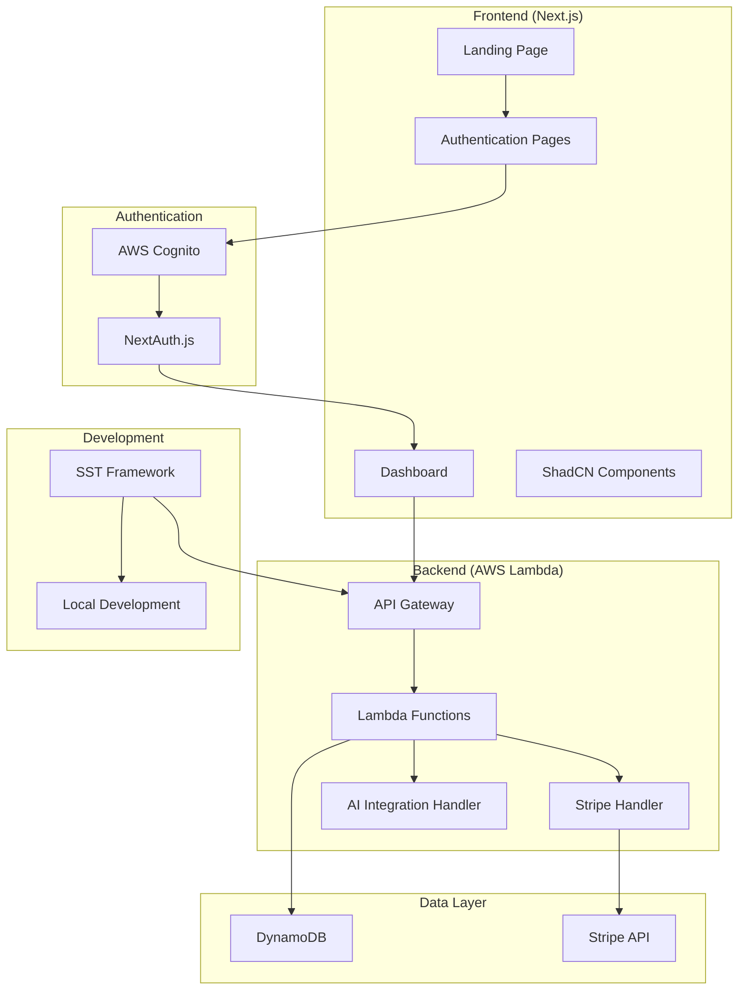

# Design Document

## Overview

The Simple SaaS Template is a minimal, production-ready starter template designed for AI-focused SaaS applications. The architecture follows modern serverless patterns using AWS services, with a focus on simplicity, scalability, and developer experience. The template provides essential SaaS functionality including user authentication, subscription management, and a professional dashboard while maintaining clean, extensible code.

The system is built with a clear separation between frontend and backend, using SST (Serverless Stack) for infrastructure management and local development. This enables rapid development cycles and seamless deployment to AWS.

## Architecture

### High-Level Architecture



### Technology Stack

**Frontend:**
- Next.js 14 with TypeScript and App Router
- ShadCN UI components for consistent design system
- Tailwind CSS for styling
- NextAuth.js for authentication integration

**Backend:**
- Node.js/TypeScript Lambda functions
- AWS API Gateway for REST endpoints
- AWS Cognito for user management
- DynamoDB for data persistence

**Infrastructure:**
- SST (Serverless Stack) for infrastructure as code
- AWS CDK for underlying infrastructure
- Local development environment with hot reload

**Third-Party Services:**
- Stripe for payment processing and subscription management
- AWS Bedrock (ready for AI integration)

## Components and Interfaces

### Frontend Components

#### Core Layout Components
- **AppLayout**: Root layout with navigation and authentication context
- **LandingLayout**: Clean layout for marketing pages
- **DashboardLayout**: Authenticated layout with sidebar navigation
- **AuthLayout**: Centered layout for authentication forms

#### UI Components (ShadCN-based)
- **Button**: Primary, secondary, and ghost variants
- **Card**: Content containers with consistent styling
- **Form**: Form components with validation
- **Table**: Data display with sorting and pagination
- **Modal**: Overlay components for actions
- **Toast**: Notification system

#### Feature Components
- **PricingCard**: Subscription plan display
- **SubscriptionGate**: Paywall component for premium features
- **UserProfile**: User account management
- **DashboardStats**: Metrics and analytics display

### Backend API Endpoints

#### Authentication Endpoints
```typescript
POST /auth/signup
POST /auth/signin
POST /auth/signout
GET /auth/session
```

#### Subscription Endpoints
```typescript
POST /stripe/create-checkout-session
POST /stripe/webhook
GET /subscription/status
POST /subscription/cancel
```

#### User Management
```typescript
GET /user/profile
PUT /user/profile
DELETE /user/account
```

#### AI Integration (Ready)
```typescript
POST /ai/generate
GET /ai/history
POST /ai/feedback
```

### Data Models

#### User Model
```typescript
interface User {
  id: string;
  email: string;
  name: string;
  createdAt: string;
  updatedAt: string;
  subscriptionStatus: 'active' | 'inactive' | 'cancelled';
  subscriptionId?: string;
  cognitoId: string;
}
```

#### Subscription Model
```typescript
interface Subscription {
  id: string;
  userId: string;
  stripeSubscriptionId: string;
  status: 'active' | 'past_due' | 'cancelled' | 'incomplete';
  currentPeriodStart: string;
  currentPeriodEnd: string;
  planId: string;
  createdAt: string;
  updatedAt: string;
}
```

#### AI Session Model (Ready)
```typescript
interface AISession {
  id: string;
  userId: string;
  prompt: string;
  response: string;
  model: string;
  tokens: number;
  createdAt: string;
}
```

## Error Handling

### Frontend Error Handling
- **Basic Error Boundary**: Simple error display for unhandled errors
- **Form Validation**: Basic validation with error states
- **API Error Handling**: Simple error response handling
- **Toast Notifications**: Basic success/error messages

### Backend Error Handling
- **Simple Error Responses**: Basic error formatting
- **Input Validation**: Essential validation only
- **Basic Error Logging**: Console logging for development

### Error Response Format
```typescript
interface ErrorResponse {
  error: string;
  message: string;
}
```

## Security Considerations

### Authentication Security
- AWS Cognito handles password policies and MFA
- JWT tokens with proper expiration
- Secure session management with NextAuth.js
- CSRF protection enabled

### API Security
- API Gateway with request validation
- Lambda authorizers for protected endpoints
- Rate limiting and throttling
- Input sanitization and validation

### Data Security
- DynamoDB encryption at rest
- Secure environment variable management
- HTTPS enforcement
- Stripe webhook signature verification

## Performance Optimization

### Frontend Performance
- Next.js App Router with streaming
- Image optimization with Next.js Image component
- Code splitting and lazy loading
- Static generation for marketing pages

### Backend Performance
- Lambda cold start optimization
- DynamoDB single-table design
- Connection pooling for external APIs
- Caching strategies for frequently accessed data

## Deployment Strategy

### Development Environment
- SST local development with hot reload
- Local DynamoDB for testing
- Environment-specific configuration
- Simple Git workflow

### Production Deployment
- Manual deployment via SST
- Basic environment variable management

## Scalability Considerations

### Horizontal Scaling
- Lambda functions scale automatically
- DynamoDB on-demand scaling
- API Gateway handles traffic spikes
- CDN integration for static assets

### Vertical Scaling
- Lambda memory and timeout configuration
- DynamoDB capacity planning
- Connection pool optimization
- Caching layer implementation

## Integration Points

### Stripe Integration
- Embedded checkout for seamless UX
- Webhook handling for subscription updates
- Customer portal for self-service
- Invoice and payment management

### AWS Cognito Integration
- User pool configuration
- Social login providers ready
- Custom attributes support
- Password reset flows

### AI Service Integration (Ready)
- AWS Bedrock client configuration
- Token usage tracking
- Response caching
- Error handling for AI services

## Development Workflow

### Local Development Setup
1. Clone template repository
2. Install dependencies with npm/yarn
3. Configure environment variables
4. Run `sst dev` for local development
5. Access frontend at localhost:3000

### Code Organization
```
src/
├── app/                 # Next.js app router pages
├── components/          # Reusable UI components
├── features/           # Feature-specific components
├── lib/                # Utility functions and configs
├── types/              # TypeScript type definitions
└── styles/             # Global styles and themes

backend/
├── functions/          # Lambda function handlers
├── lib/               # Shared backend utilities
├── types/             # Backend type definitions
└── stacks/            # SST stack definitions
```

### Environment Configuration
- Development: Local environment with SST
- Staging: AWS environment for testing
- Production: Production AWS environment
- Environment-specific variables managed securely